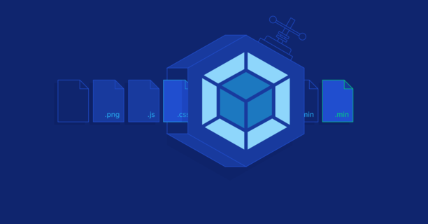

# webpack-pratice

1. [webpack-basic, 웹팩의 기본을 다루어 봅시다](./webpack-basic/README.md)
2. [webpack-css-extract-plugin, 웹팩의 css-extract 플러그인을 다루어 봅시다](./webpack-css-extract-plugin/README.md)
3. [webpack-split-chunks, 웹팩의 청크 파일 분리를 다루어 봅시다](./webpack-split-chunks/README.md)
4. [webpack-runtime-chunk, 런타임 코드 파일 분리를 다루어 봅시다](./webpack-runtime-chunks/README.md)
5. [webpack-dev-server, 웹팩 데브서버를 다루어 봅시다](./webpack-dev-server/README.md)
6. [webpack-mode-config, 웹팩의 모드 설정을 다루어 봅시다](./webpack-mode-config/README.md)
7. [webpack-tree-shaking, 웹팩 트리-쉐이킹에 대해 이해해 봅시다](./webpack-tree-shaking/README.md)

## webpack을 다루는 좋은 글

[Webpack을 활용한 성능향상 - 캐싱 활용하기](https://yceffort.kr/2020/07/make-use-of-long-term-caching)
