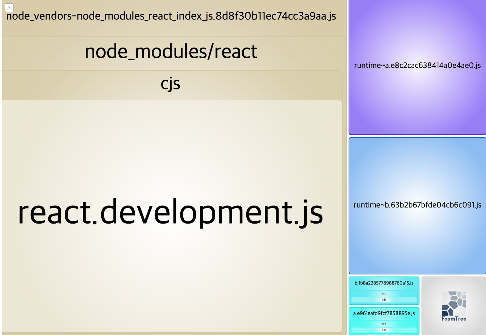

# webpack-runtime-chunks

`optimization`의 `runtimChunks` 옵션은 웹팩의 런타임 코드를 따로 분리할 수 있도록 한다. 런타임 코드는 초기에 청크를 로딩하는 역할을 수행하는데
웹팩은 런타임 코드를 가장 마지막에 생성된 청크에 삽입한다. vendor 파일이 그 예시이다.

## runtime-chunks를 분리해야 하는 이유

청크를 분리하는 이유 중 하나는 자주 변하지 않는 앱 의존성의 특성에 따라 이것을 다른 파일로 분리하여 브라우저에서 별도로 캐시하기 한결 편하도록 돕기 때문에 내부 로직이 변경된다면 의존성이 담긴 청크들을 별도로 다운받지 않아도 된다.

하지만 가령 내부 로직이 변경되면 의존성 모듈들이 담긴 청크에도 변화가 발생한다. 이는 벤더 청크에도 런타임 코드가 삽입되어 있기 때문에 내부 로직이 수정되고 빌드를 하면 벤더 청크에 들어있던 런타임 코드도 수정이 되기 때문이다.

벤더 청크가 변경되었다는 것을 간단하게 확인하기 위해 `output` 속성에 `filename`에서 각 모듈 내용을 기준으로 생성된 해시 값을 포함하는 `chunkhash`를 사용하도록 했다.

## runtimeChunk

런타임 코드를 또 다른 청크를 만들기 위해서는 `optimization` 속성의 `runtimeChunk`를 `true`로 설정하면 된다.

```js
//webpack.config.js

optimization: {
  runtimeChunk: true,
  ...
}
```

새롭게 런타임 파일이 생성되는 것을 확인할 수 있다.



## Reference

[Webpack을 활용한 성능향상 - 캐싱 활용하기](https://yceffort.kr/2020/07/make-use-of-long-term-caching)
