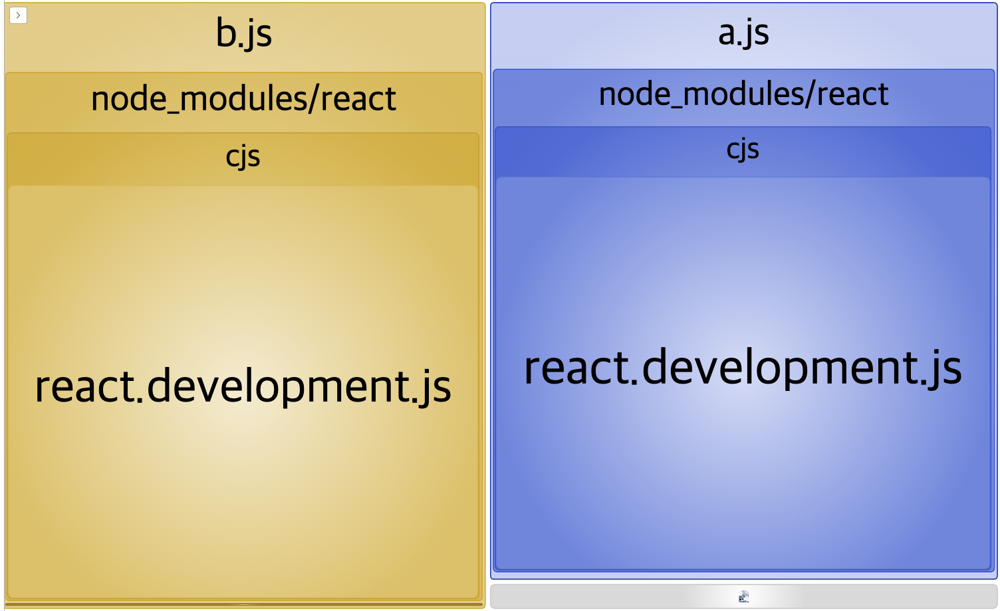
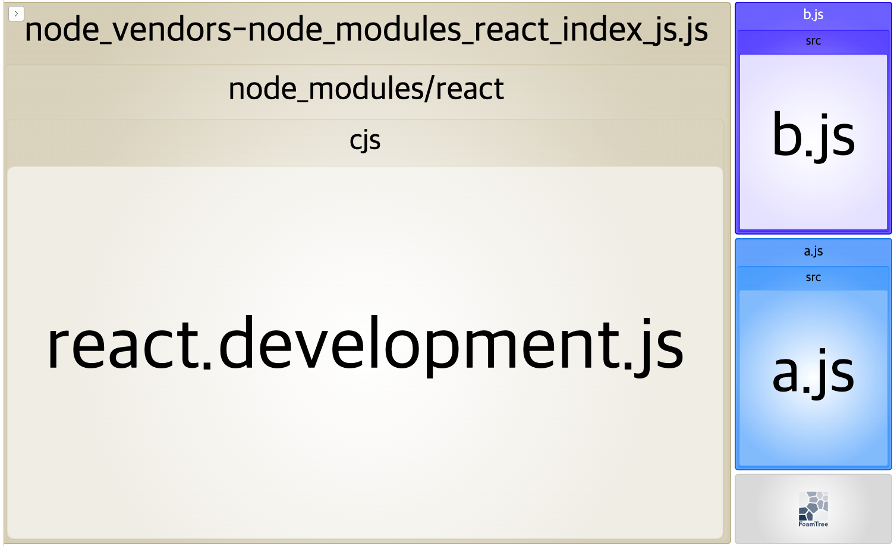
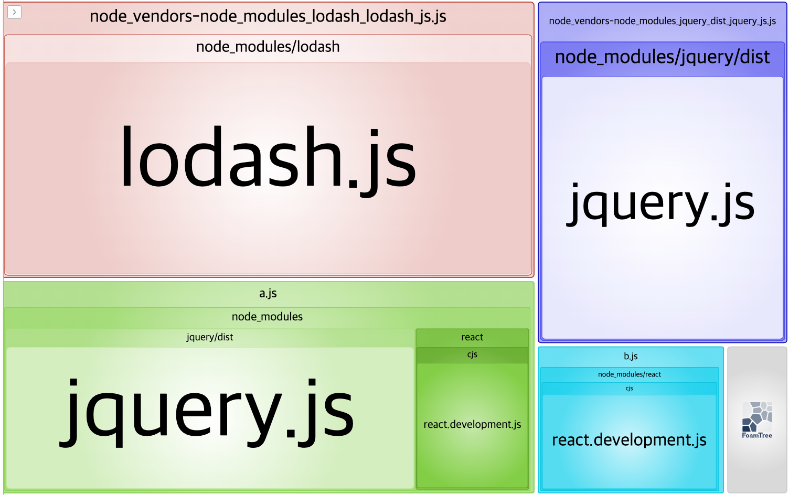
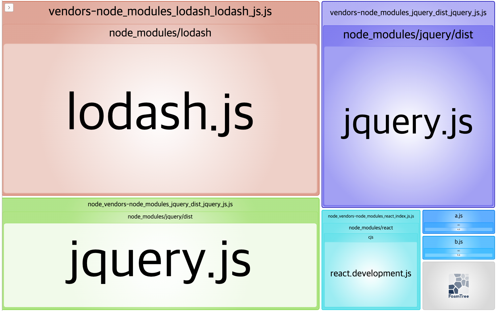

# webpack-split-chunk-plugin

## SplitChunks

`SplitChunks`는 여러 청크(번들)들 간에 공통적으로 사용되는 모듈들을
다른 번들로 추출하여 관리해주는 역할을 한다.

코드 스플리팅은 웹팩에서 제공하는 주요한 기능 중 하나로

- 코드를 다양한 번들로 구성해주며
- 번들이 필요할 때 병렬로 로드될 수 있고
- 리소스 부하를 줄이기 위해 우선순위를 제어할 수 있다.

웹팩에서는 보통,

- Entry Points를 통해
- SplitChunksPlugin을 통한 중복을 제거하고 공통적인 모듈을 추출
- `Dynamic import`를 통해 모듈 내에서 인라인 함수 호출을 통해

코드를 스플릿한다.

## SplitChunks 옵션 이해를 위한 예제

우선, 예시로 사용될 공통된 모듈 의존성을 추가한다.

```
~$ yarn add react
~$ yarn add lodash
~$ yarn add jquery
```

추가적으로, 번들을 가시적으로 분석하기 위해 플러그인을 추가한다.

```
~$ yarn add -D webpack-bundle-analyzer
```

```js
//webpack.config.js

const BundleAnalyzerPlugin =
  require("webpack-bundle-analyzer").BundleAnalyzerPlugin;

module.exports = {
  plugins: [new BundleAnalyzerPlugin()],
};
```

```js
//src/a.js

import "react";

console.log("a file!");
var a = 10;

export default a;
```

```js
//src/b.js
import "react";

console.log("b file!");
var b = 10;

export default b;
```

src에 a, b 파일을 생성하고 모든 파일에 react를 import하여 모듈을 추가했다. webpack config를 수정하고 빌드하면 번들들이 어떻게 구성되어 있는 지 확인할 수 있다.

```js
const BundleAnalyzerPlugin =
  require("webpack-bundle-analyzer").BundleAnalyzerPlugin;

module.exports = {
  entry: {
    a: "./src/a.js",
    b: "./src/b.js",
  },
  plugins: [new BundleAnalyzerPlugin()],
};
```

a, b파일에서 모두 react를 import한 결과 a,b 번들 모두에서 react 모듈을 포함하고 있는 것을 확인할 수 있다.



공통된 모듈을 분리하여 또 다른 번들로 분리해보자. `optimization` 옵션을 추가할 때 각각의 속성이 하는 역할은 다음과 같다.

- `priority`, 모듈이 어떤 캐시 그룹에 포함될 지 결정하는 과정에서 캐시 그룹들 중 우선순위가 높은 캐시 그룹에 속하게 된다.
- `test`, 캐시 크룹에 추가할 모듈의 선택을 제어한다. 절대 경로나, 청크 이름, 정규표현식을 통해 값을 정의한다.
- `filename`, 모듈이 분리되어 생성되는 청크 파일의 이름을 값으로 정의한다.
- `enforce`, 상위 splitChunks 객체에서 설정된 옵션을 무시하고 본 캐시 그룹에서 설정된 청크 옵션에 따라 생성되도록 제어한다.
- `minChunk`, 청크들 사이에서 공유되는 모듈의 최소갯수를 제어한다.

즉, 아래와 같은 설정을 했을 때는 다음과 같이 청크가 생성된다.

**`cacheGroups` 설정에 따라, node_modules 폴더에 속하는 파일은 모두 번들링한다.**

### chunks: "all"

```js
const BundleAnalyzerPlugin =
  require("webpack-bundle-analyzer").BundleAnalyzerPlugin;

module.exports = {
  mode: "development",
  entry: {
    a: "./src/a.js",
    b: "./src/b.js",
  },
  plugins: [new BundleAnalyzerPlugin()],
  optimization: {
    splitChunks: {
      cacheGroups: {
        node_vendors: {
          test: /[\\/]node_modules[\\/]/,
          chunks: "all",
          priority: 1,
        },
      },
    },
  },
};
```

`optimization` 설정을 추가하고, 다시 빌드해보면 빌드 결과물에 `node_vendors~` 라는 새로운 번들이 추가된다. 이곳에는 react가 포함되어 있고, a, b 번들에는 import한 react가 빠져있음을 확인할 수 있다. 공통된 모듈을 따로 분리해서 새로운 번들을 만드는 중복 제거 작업을 통해 최적화를 진행할 수 있다.



### chunks: "async"

`chunks` 옵션을 'async'로 변경해보자. 'async'는 캐시 그룹의 `test`속성에 입각한 파일들 중 비동기로 import된 파일들을 포함시키는 옵션이다.

```js
//webpack.config.js
...
optimization: {
    splitChunks: {
      cacheGroups: {
        node_vendors: {
          test: /[\\/]node_modules[\\/]/,
          chunks: "async",
          priority: 1,
        },
      },
    },
  },
```

이후 빌드를 진행해보면 `optimization` 설정이 없었던 초기 번들 모습과 동일한 결과가 나온다. 비동기적으로 import한 모듈이 없기 때문이다. 새롭게 추가해보자

```js
//src/a.js
import "react";
import ("lodash"); //dynamic import
import "jquery";

...
```

```js
//src/b.js
import "react";
import("lodash"); //dynamic import
import("jquery"); //dynamic import

...
```

a, b 파일 모두에서 동적으로 import한 lodash의 경우 최적화된 새로운 청크에 포함되었다. 반면, a에서는 정적으로, b에서는 동적으로 import한 jquery의 경우 동적으로 import한 b에서만 분리되어 최적화된 것을 확인할 수 있다.



### chunks: "initial"

`chunks`의 'initial' 옵션은 정적으로 import된 모듈들을 묶어 새로운 번들로 만든다. 위와 동일한 코드로 속성만 변경하여 빌드해보자.

```js
//webpack.config.js
...
optimization: {
    splitChunks: {
      cacheGroups: {
        node_vendors: {
          test: /[\\/]node_modules[\\/]/,
          chunks: "initial",
          priority: 1,
        },
      },
    },
  },
```

정적으로 import된 모듈에 대해서는 별도의 청크로 만든다. 여기서, 주목해야 할 점은 동적으로 import된 모듈들 또한 별도로 청크를 만들어 코드를 분리한다. 동적으로 import된 모듈은 파일이 분리되어 있어야 동적으로 불러올 수 있기 때문이다.



## Reference

[Webpack 4 — Mysterious SplitChunks Plugin](https://medium.com/dailyjs/webpack-4-splitchunks-plugin-d9fbbe091fd0)
